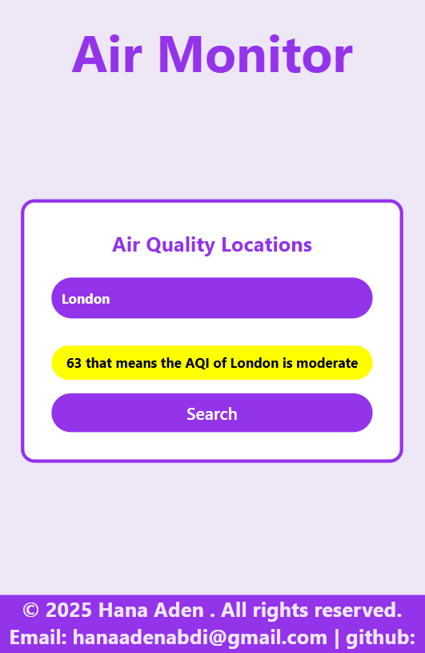

# Air Monitor - React Air Quality App

## Description

Air Monitor is a responsive web application built with React, TypeScript, and Tailwind CSS that allows users to check the air quality (AQI) of any city. The app fetches data from the API Ninjas Air Quality API and displays the overall AQI with color-coded indicators (green, yellow, red) and a human-readable status message.

## Features

Enter any city and fetch its Air Quality Index (AQI).

Dynamic color indicators for AQI:

Green: Good (≤50)

Yellow: Moderate (51–100)

Red: Unhealthy (>100)

Responsive UI that works on mobile, tablet, and desktop.

Modern card-style layout with styled input, buttons, and AQI display.

Handles API errors gracefully with console logging.

## screenshot

## Technologies

React (Functional Components & Hooks)

TypeScript

Tailwind CSS

Axios for API requests

API Ninjas Air Quality API

## Live Demo

[Check it out here!](https://aqi-app-lemon.vercel.app/)